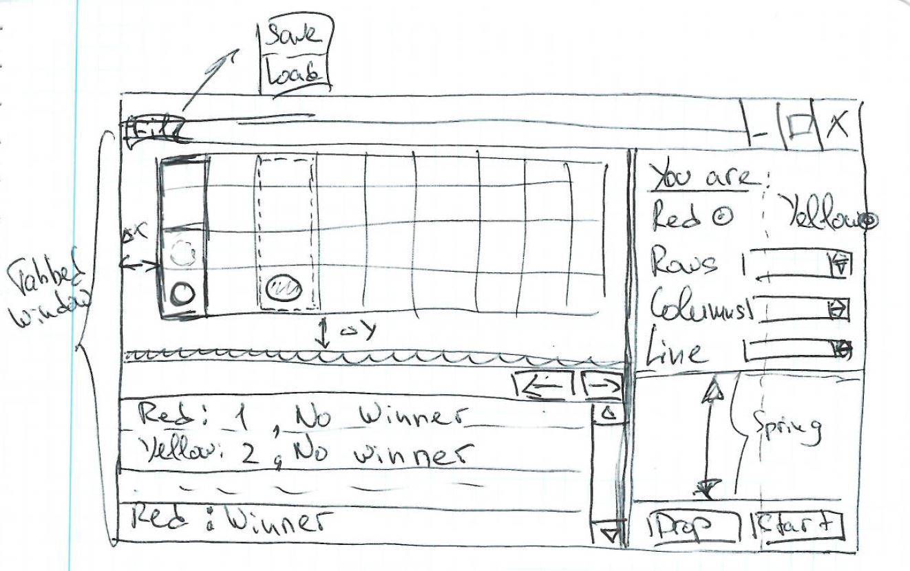

# 2019-06-17
## Short-Term To Do
### Topics
#### UI
* Basic Window for the playing with ability to choose the board size and the length of checkers for the winning state.
#### Documentation
* Is it good decision to write documentation in markdown with the code itself?..
## Done
### Topics
#### Computer opponent
* Some design of how GUI game should look like: 
## Long-Term To Do
### Topics
#### UI
* UI for the server mode with played games.
#### Network
* Design how the network playing will look like:
    - Rooms? roles? waiting? etc.
    - Should the server mode have persistent storage for players and roles?
#### Documentation
* Write a full explanation of the minimax terminal algorithms why and how it works

# 2019-06-14
## Short-Term To Do
### Topics
#### UI
* Design the UI for game.
* Basic Window for the playing with ability to choose the board size and the length of checkers for the winning state.
#### Documentation
* Is it good decision to write documentation in markdown with the code itself?..
## Done
### Topics
#### Computer opponent
* Computer opponent is done and knows playing
    - Many bug-fixes.
        1. Win terminal was not codded properly. Bits that hold and information about already checked
        directions were no updated properly.
        2. Minimax was not playing properly. Once it gets to a situation when it should already win (i.e. it gets the
        same score on all terminals that it is about to win) it did not chose the right move. Fixed by adding
        "depth_correction" while minimax is calculated: the more close to starting node win situations (nodes) get
        more score: "win_score + 1 / depth"
    - The main heuristic terminal looks like it works well
* Console game is codded. (It was a good decision in general to code it before GUI, since a lot of bugs are caught
during some surface playing)
## Long-Term To Do
### Topics
#### UI
* UI for the server mode with played games.
#### Network
* Design how the network playing will look like:
    - Rooms? roles? waiting? etc.
    - Should the server mode have persistent storage for players and roles?
#### Documentation
* Write a full explanation of the minimax terminal algorithms why and how it works

# 2019-05-25
## Short-Term To Do
### Topics
#### Computer opponent
* Implement the alpha betta minimax algorithm.
## Done
### Topics
#### Project Management
* The project became "more mature". Vision and progress have been added.
#### Computer opponent
* Overall design
    - Since the game is zero-sum game the main algorithm for the computer opponent will be a minimax algorithm with
    alpha betta pruning.
* Two minimax terminals (leaves of the tree) are coded:
    - Win game terminal (how do we decide that the game has a winner)
    - The score terminal (how do we decide that our position is better than of the opponent)
### Topics
## Long-Term To Do
### Topics
#### UI
* Design the UI for game.
* Basic Window for the playing with ability to choose the board size and the length of checkers for the winning state.
* UI for the server mode with played games.
#### Network
* Design how the network playing will look like:
    - Rooms? roles? waiting? etc.
    - Should the server mode have persistent storage for players and roles?
#### Documentation
* Write a full explanation of the minimax terminal algorithms why and how it works
